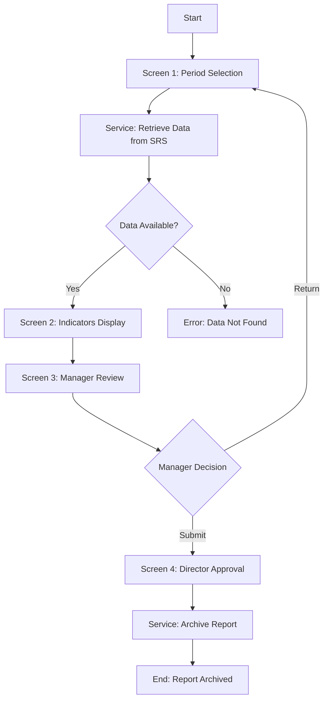

# Liquidity Risk Indicators - jBPM Process


## 📋 Overview

This is a complete jBPM implementation of the **Liquidity Risk Indicators Monitoring System** for Al Wahda Bank, based on the Software Requirements Specification (SRS) V2.3 dated December 8, 2025.

The system monitors three key liquidity indicators derived from the Regulatory Reporting System - Central Bank of Libya Requirements:

1. **LCR** - Liquidity Coverage Ratio (نسبة تغطية السيولة)
2. **NSFR** - Net Stable Funding Ratio (نسبة التمويل المستقر الصافي)
3. **Leverage Ratio** (نسبة الرافعة المالية)

## 🎯 Business Objectives

- ✅ Accurate Liquidity Risk Monitoring using verified monthly data
- ✅ Automated Quarterly Ratio Generation with predefined formulas
- ✅ Enhanced Managerial Oversight through multi-level workflow
- ✅ Centralized Liquidity Reporting Repository
- ✅ Support for Internal Liquidity Risk Assessments
- ✅ Improved Data Integrity through system integration
- ✅ Streamlined Reporting and Documentation

## 🏗️ Architecture

### System Components

```
liquidity-risk-jbpm/
├── src/main/
│   ├── java/com/wahda/liquidity/
│   │   ├── model/
│   │   │   ├── LiquidityIndicator.java
│   │   │   └── LiquidityReport.java
│   │   ├── service/
│   │   │   ├── IndicatorCalculationService.java
│   │   │   ├── SRSDataRetrievalService.java
│   │   │   └── ValidationService.java
│   │   └── handler/
│   │       ├── DataRetrievalWorkItemHandler.java
│   │       └── ArchiveWorkItemHandler.java
│   └── resources/
│       ├── processes/
│       │   └── liquidity-risk-indicators.bpmn
│       ├── forms/
│       │   ├── screen1-period-selection.frm
│       │   ├── screen2-indicators-display.frm
│       │   ├── screen3-manager-review.frm
│       │   └── screen4-director-approval.frm
│       ├── scripts/
│       │   └── manager-return-validation.js
│       └── META-INF/
│           ├── kmodule.xml
│           └── kie-deployment-descriptor.xml
├── pom.xml
└── README.md
```

## 🔄 Workflow

The process follows a **4-screen workflow** with multi-level approval:



### Screen Details

#### **Screen 1: Period Selection** 📅
- User selects year and quarter range (Q1-Q2, Q2-Q3, or Q3-Q4)
- System defaults to current year and appropriate quarter
- Validates selection before proceeding

#### **Screen 2: Liquidity Risk Indicators** 📊
- Displays calculated quarterly values for all three indicators
- Shows Q1 Result, Q2 Result, and Absolute Coverage (Q2 - Q1)
- All values are **view-only** (system-generated)
- Optional comment field for employee
- Actions: Save (draft) or Submit (to manager)

#### **Screen 3: Manager Review** 👔
- Manager reviews indicators and employee comment
- Can add optional comment
- Decisions:
  - **Submit**: Forward to Risk Director
  - **Return to Employee**: Requires **mandatory** comment
- Download report option available

#### **Screen 4: Director Final Approval** 🏆
- Risk Management Director reviews complete report
- Views all indicators and all comments
- **No return option** - Final approval only
- Submit archives the report permanently
- Download complete report option

## 📐 Calculation Logic

### Quarterly Value Calculation

Based on monthly delta averages (SRS Section 9):

```
For Q1 (Months 1, 2, 3):
  Delta₁ = (Month₂ - Month₁) / Month₂
  Delta₂ = (Month₃ - Month₂) / Month₃
  Q1_Result = Average(Delta₁, Delta₂)

Same logic for Q2 with months 4, 5, 6
```

### Absolute Coverage

```
Absolute Coverage = Q2_Result - Q1_Result
```

## 🔧 Installation & Setup

### Prerequisites

- Java 11 or higher
- Maven 3.6+
- jBPM Server 7.74.1 or compatible version
- Database (PostgreSQL/MySQL recommended)

### Build Instructions

1. **Clone the repository**
```bash
cd liquidity-risk-jbpm
```

2. **Build the project**
```bash
mvn clean install
```

3. **Deploy to jBPM**
```bash
mvn clean install -DskipTests
# Deploy the generated KJAR to your jBPM server
```

### jBPM Server Configuration

1. **Configure Work Item Handlers** in Business Central:
   - Navigate to Settings → Custom Tasks
   - Add `DataRetrieval` handler
   - Add `ArchiveReport` handler

2. **Configure User Groups and Roles**:
   - `risk-employee` - Can access Screen 1 & 2
   - `risk-manager` - Can access Screen 3
   - `risk-director` - Can access Screen 4
   - `admin` - Full access

3. **Configure Database Connection**:
   - Update `persistence.xml` with your database settings
   - Ensure connection to SRS Phase 1 database

## 📝 Data Models

### LiquidityIndicator
Represents a single indicator (LCR, NSFR, or Leverage Ratio)

**Key Fields:**
- `indicatorType`: Type of indicator
- `q1Month1Value`, `q1Month2Value`, `q1Month3Value`: Q1 monthly data
- `q2Month1Value`, `q2Month2Value`, `q2Month3Value`: Q2 monthly data
- `q1Result`, `q2Result`: Calculated quarterly results
- `absoluteCoverage`: Q2 - Q1

### LiquidityReport
Main report containing all indicators and workflow information

**Key Fields:**
- `selectedYear`, `selectedQuarterRange`: Selected period
- `lcrIndicator`, `nsfrIndicator`, `leverageRatioIndicator`: The three indicators
- `employeeComment`, `managerComment`, `directorComment`: Comments
- `status`: DRAFT, SUBMITTED_TO_MANAGER, SUBMITTED_TO_DIRECTOR, APPROVED, ARCHIVED, RETURNED
- `currentStage`: SCREEN_1, SCREEN_2, SCREEN_3, SCREEN_4

## ✅ Validations

### Screen 1 Validations
- Year must be selected
- Quarter range must be selected
- Quarter range must be valid: Q1_Q2, Q2_Q3, or Q3_Q4

### Screen 2 Validations
- Comment length ≤ 2000 characters
- All indicator values must be present
- Values are view-only (cannot be modified)

### Screen 3 Validations
- Decision must be selected (SUBMIT or RETURN)
- **If RETURN**: Comment is **mandatory**
- Comment length ≤ 2000 characters

### Screen 4 Validations
- Comment length ≤ 2000 characters (optional)
- No return option available

## 🔒 Security Features

- **Role-based access control** (RBAC)
- **Input sanitization** to prevent XSS and injection attacks
- **Audit trail** for all actions and approvals
- **Data integrity** - All values system-generated from SRS database
- **No manual editing** of calculated values

## 📊 Process RACI Matrix

| Process Step | Employee (Maker) | Direct Manager | Risk Director | System |
|-------------|------------------|----------------|---------------|--------|
| Select reporting year & quarter | R | | | A |
| Retrieve quarterly data | | | | R/A |
| Display liquidity indicators | | | | R/A |
| Add employee comment | R | | | I |
| Submit report to manager | R | | | I |
| Review employee submission | | R | | I |
| Submit to Risk Director | | R/A | | I |
| Final review & approval | | | R/A | I |
| Archive final report | | | A | R |

**Legend:** R = Responsible, A = Accountable, I = Informed

## 🧪 Testing

### Test Cases Included

1. **TC-LR-001**: Period Selection with Valid Year and Quarter Range
2. **TC-LR-002**: Attempt to Submit Without Selecting Quarter Range
3. **TC-LR-003**: Load Liquidity Indicators for Selected Period
4. **TC-LR-004**: Save Liquidity Report Draft with Comment
5. **TC-LR-005**: Submit Liquidity Indicators to Direct Manager
6. **TC-LR-006**: Return Report to Employee Without Comment (should fail)
7. **TC-LR-007**: Submit Reviewed Report to Risk Management Director
8. **TC-LR-008**: Download Liquidity Risk Report
9. **TC-LR-009**: Risk Director Approves and Archives Report
10. **TC-LR-010**: Verify Director Cannot Return Report

### Running Tests
```bash
mvn test
```

## 📈 Monitoring & Audit

The system provides comprehensive audit trails:

- **Process Instance Tracking**: Track each report through the workflow
- **Task Completion Logging**: Log all user actions and decisions
- **Data Change History**: Track all modifications to reports
- **Archive Records**: Maintain permanent records of approved reports

## 🌐 Internationalization

The system supports **bilingual** interface:
- English (EN)
- Arabic (AR)

All forms, error messages, and validations include both languages.

## 🔗 Integration with SRS Phase 1

The system integrates with the Regulatory Reporting System through:

1. **SRSDataRetrievalService**: Retrieves monthly indicator values
2. **Automated validation**: Checks data availability before processing
3. **Error handling**: Graceful handling of missing data scenarios

### Implementation Notes

The `SRSDataRetrievalService.retrieveMonthlyValue()` method should be implemented to connect to your actual SRS database:

```java
public BigDecimal retrieveMonthlyValue(String indicatorType, int year, int month) {
    // TODO: Implement actual database connection
    // Example query:
    // SELECT ratio_value FROM regulatory_reports
    // WHERE indicator_type = ? AND report_year = ? AND report_month = ?
    // AND status = 'APPROVED'
}
```

## 📞 Support & Maintenance

For issues, questions, or contributions:

- **Created By**: Mohamed ALKOLES (MK)
- **Version**: 2.3.0
- **Date**: December 8, 2025
- **Organization**: Al Wahda Bank - Risk Management Department

## 📄 License

Copyright © 2025 Al Wahda Bank. All rights reserved.

This software is proprietary and confidential. Unauthorized copying, distribution, or use is strictly prohibited.

---

## 🚀 Quick Start Guide

### 1. Deploy to jBPM Business Central

```bash
# Build the KJAR
mvn clean install

# The KJAR will be generated in target/liquidity-risk-jbpm-2.3.0.jar
```

### 2. Import in Business Central

1. Log in to jBPM Business Central
2. Go to **Menu → Design → Projects**
3. Click **Import Project**
4. Select the generated KJAR file
5. Deploy to Execution Server

### 3. Start a Process Instance

```java
// Example code to start the process
KieServices ks = KieServices.Factory.get();
KieContainer kContainer = ks.getKieClasspathContainer();
KieSession kSession = kContainer.newKieSession("liquidityRiskKSession");

// Create a new report
LiquidityReport report = new LiquidityReport();
report.setEmployeeId("EMP001");
report.setManagerId("MGR001");
report.setDirectorId("DIR001");

// Start process
Map<String, Object> params = new HashMap<>();
params.put("report", report);
ProcessInstance processInstance = kSession.startProcess("LiquidityRiskIndicators", params);
```

### 4. Complete User Tasks

```java
// Get tasks for a user
TaskService taskService = ...;
List<TaskSummary> tasks = taskService.getTasksAssignedAsPotentialOwner("userId", "en-UK");

// Complete a task
taskService.start(taskId, "userId");
Map<String, Object> results = new HashMap<>();
results.put("selectedYear", 2025);
results.put("selectedQuarterRange", "Q1_Q2");
taskService.complete(taskId, "userId", results);
```

---

## 🎓 Additional Resources

- [jBPM Documentation](https://docs.jbpm.org/)
- [Business Central User Guide](https://docs.jbpm.org/latest/jbpm-docs/html_single/#_wb.business_central)
- [BPMN 2.0 Specification](https://www.omg.org/spec/BPMN/2.0/)
- Original SRS Document: `Liquidity Risk Indicators_V2.3.pdf`

---

**Built with ❤️ for Al Wahda Bank Risk Management Department**
